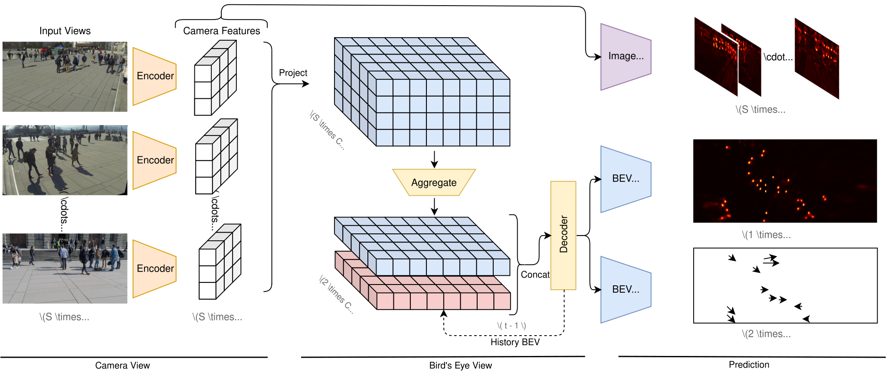

# TrackTacular :octopus:

**Lifting Multi-View Detection and Tracking to the Bird’s Eye View**

[Torben Teepe](https://github.com/tteepe),
[Philipp Wolters](https://github.com/phi-wol),
[Johannes Gilg](https://github.com/Blueblue4),
[Fabian Herzog](https://github.com/fubel),
Gerhard Rigoll

[](https://arxiv.org/abs/2403.12573)

[](https://paperswithcode.com/sota/multi-object-tracking-on-wildtrack?p=lifting-multi-view-detection-and-tracking-to)
[](https://paperswithcode.com/sota/multi-object-tracking-on-multiviewx?p=lifting-multi-view-detection-and-tracking-to)
[](https://paperswithcode.com/sota/multiview-detection-on-multiviewx?p=lifting-multi-view-detection-and-tracking-to)

> [!TIP]
> This work is an extension of your previous work [EarlyBird  🦅](https://github.com/tteepe/EarlyBird).
> Feel free to check it out and extend our multi-view object detection and tracking pipeline on other datasets!



## Usage

### Getting Started
1. Install [PyTorch](https://pytorch.org/get-started/locally/) with CUDA support
    ```shell
   pip3 install torch torchvision --index-url https://download.pytorch.org/whl/cu118
   ```
2. Install [mmcv](https://mmcv.readthedocs.io/en/latest/get_started/installation.html#install-with-pip) with CUDA support
   ```shell
   pip install mmcv==2.0.0 -f https://download.openmmlab.com/mmcv/dist/cu118/torch2.1/index.html
   ```
3. Install remaining dependencies
   ```shell
   pip install -r requirements.txt
   ```

### Training
```shell
python world_track.py fit -c configs/t_fit.yml \
    -c configs/d_{multiviewx,wildtrack,synthehicle}.yml \
    -c configs/m_{mvdet,segnet,liftnet,bevformer}.yml
```

### Partial supervision with BEV pseudo-labels
TrackTacular/WorldTrack can consume the offline detection cache generated by `Baselines/Code/MVDetBRL/generate_pseudo_cache.py`. The cache stores original-image person boxes by frame and camera. During training, foot points are projected with the dataset calibration, transformed into the same augmented voxel coordinates as the ground truth, and rasterized as soft BEV center evidence. Validation and test remain fully supervised and do not use pseudo-labels.

Example for Wildtrack with 60% dropped labels (run from `WorldTrack/`):

```shell
python world_track.py fit \
  -c configs/t_fit.yml \
  -c configs/d_wildtrack_brl.yml \
  -c configs/m_mvdet.yml \
  --data.init_args.data_dir "D:/path/to/Wildtrack" \
  --data.init_args.drop_ratio 60 \
  --data.init_args.pseudo_cache "../../Code/MVDetBRL/pseudo_cache/wildtrack_yolo26s.json" \
  --model.pseudo_loss_weight 0.1
```

The BRL configs expose `pseudo_conf_threshold` (0.2), `pseudo_sigma_m` (0.5 m), and `pseudo_suppress_radius_m` (1 m). Pseudo evidence is positive-only, fused across views with a pixel-wise maximum, confidence-weighted in the auxiliary BEV center loss, and suppressed near remaining GT centers. The loss weight defaults to 0.1. Use a separate cache created for MultiviewX when training that dataset.
### Testing
```shell
python world_track.py test -c model_weights/config.yaml \
    --ckpt model_weights/model-epoch=35-val_loss=6.50.ckpt
```

## Acknowledgement
- [Simple-BEV](https://simple-bev.github.io): Adam W. Harley
- [MVDeTr](https://github.com/hou-yz/MVDeTr): Yunzhong Hou

## Citation
```bibtex
@article{teepe2023lifting,
      title={Lifting Multi-View Detection and Tracking to the Bird's Eye View}, 
      author={Torben Teepe and Philipp Wolters and Johannes Gilg and Fabian Herzog and Gerhard Rigoll},
      year={2024},
      eprint={2403.12573},
      archivePrefix={arXiv},
      primaryClass={cs.CV}
}
```
